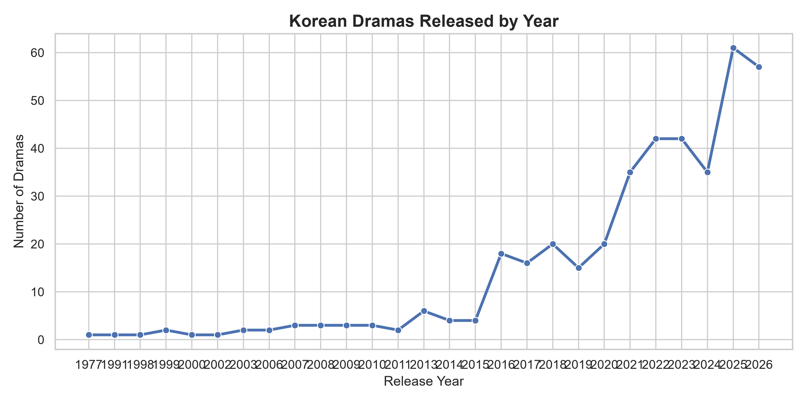
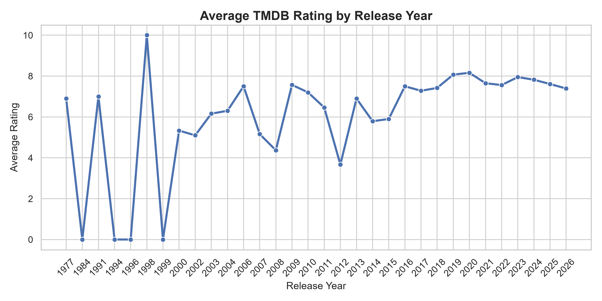
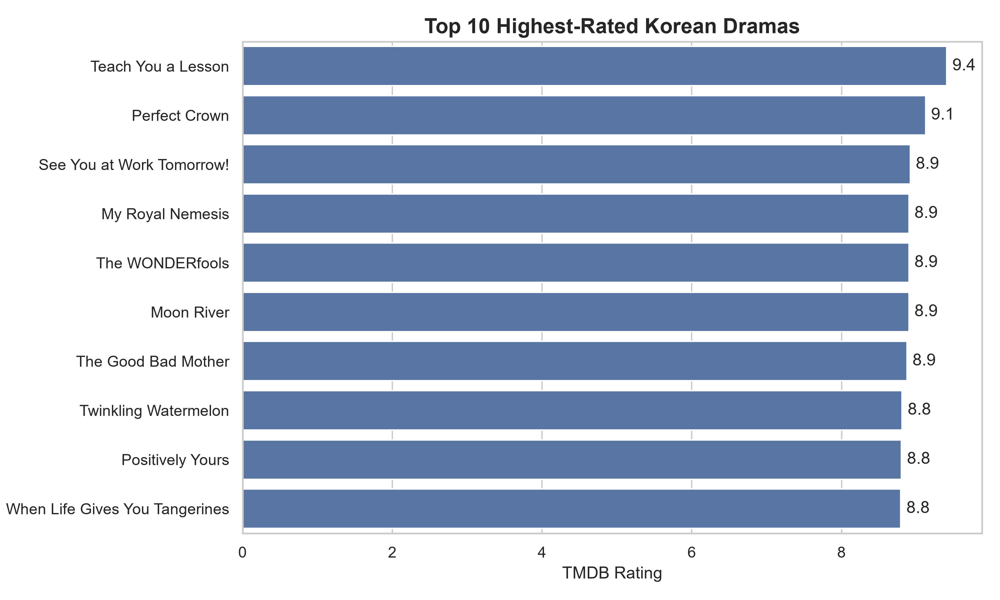
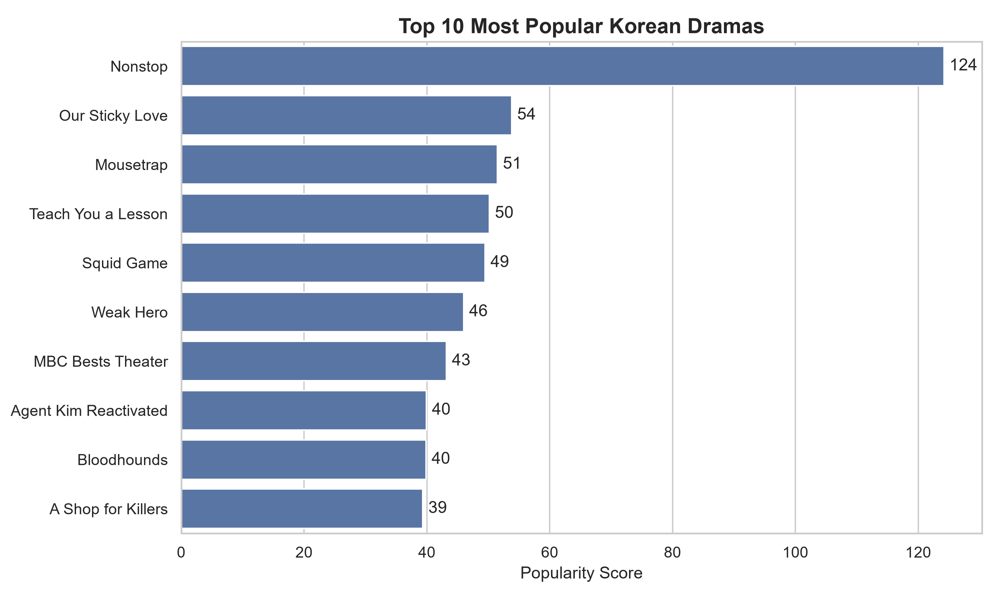
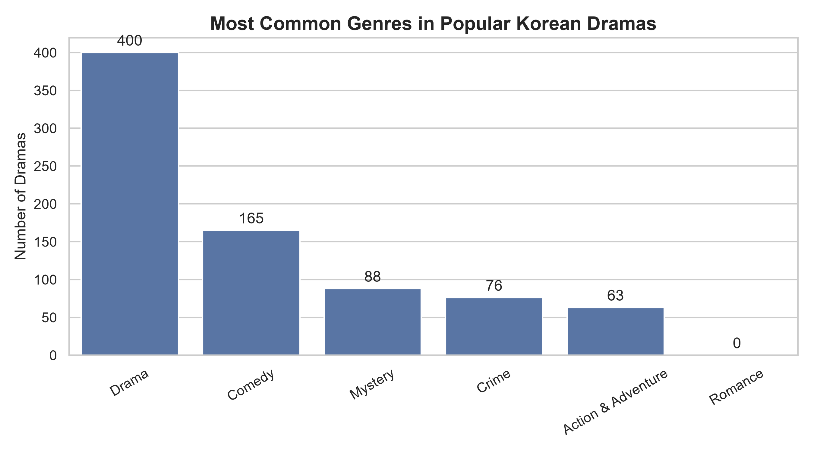

# Korean Drama Trend Analysis & Recommender

A data science project analyzing trends in popular Korean television dramas using data from The Movie Database (TMDB), culminating in a content-based recommendation system.

## Project Overview

This project explores whether the global rise in popularity of Korean dramas is reflected in genre diversity, or whether audiences are still primarily consuming a narrow set of genres. Using data collected directly from TMDB's API, the project walks through a full data science pipeline: data collection, cleaning, SQL-based analysis, visualization, and a recommendation system built from scratch.

## Table of Contents
- [Data Source](#data-source)
- [Project Structure](#project-structure)
- [Methodology](#methodology)
- [Key Findings](#key-findings)
- [Recommender System](#recommender-system)
- [Limitations](#limitations)
- [What I'd Improve Next](#what-id-improve-next)
- [How to Run](#how-to-run)
- [Tech Stack](#tech-stack)

## Data Source

Data was collected from [The Movie Database (TMDB)](https://www.themoviedb.org) using their public API. The dataset consists of the top ~400 most popular Korean TV dramas (filtered by origin country `KR` and genre `Drama`), gathered across 20 pages of results sorted by popularity.

Each show record includes: title, genre(s), first air date, TMDB rating, vote count, popularity score, and overview/synopsis.

## Project Structure

```
Asian-drama-trend-analysis/
├── data/
│   ├── raw_dramas.csv          # Raw data pulled directly from TMDB
│   └── cleaned_dramas.csv      # Cleaned, processed dataset
├── outputs/                     # Saved chart images
├── src/
│   ├── collect_data.py         # Stage 1: API data collection
│   ├── clean_data.py           # Stage 2: Data cleaning
│   ├── analyze.py              # Stage 3: SQL analysis + visualization
│   └── recommender.py          # Stage 4: Content-based recommender
├── requirements.txt
└── README.md
```

## Methodology

### 1. Data Collection (`collect_data.py`)
Used TMDB's Discover TV endpoint to pull 20 pages (~400 shows) of Korean dramas, sorted by popularity, filtered to the Drama genre at the API level.

### 2. Data Cleaning (`clean_data.py`)
- Filled missing `overview` values with a placeholder
- Checked for and confirmed zero duplicate rows
- Converted `first_air_date` to proper datetime format
- Removed unnecessary columns (`backdrop_path`, `poster_path`)
- Mapped TMDB's numeric genre IDs to human-readable genre names using TMDB's Genre List endpoint
- **Decision:** kept 10 shows with `vote_count = 0` rather than dropping them, since they still contribute valid genre and release-date data for trend analysis even without reliable rating data

### 3. SQL Analysis & Visualization (`analyze.py`)
Loaded the cleaned dataset into a local SQLite database and ran five SQL queries answering different aspects of the project's core question, each paired with a chart and written interpretation.

### 4. Recommender System (`recommender.py`)
Built a content-based recommendation system combining:
- **One-hot encoded genres** (via `MultiLabelBinarizer`)
- **TF-IDF vectorized overview text** (via `TfidfVectorizer`)
- Combined into a single feature matrix, compared using **cosine similarity**

## Key Findings

### Korean Dramas Released by Year


Production volume has grown substantially in recent years, with a sharp increase starting around 2020-2021. This likely reflects both real growth in Korean drama production and increased global platform investment (e.g. streaming services) during this period.

### Average Rating by Release Year


Average ratings remain relatively stable across most years. Earlier years contain far fewer dramas in this dataset, so individual outliers (including unrated shows) have a much larger effect on the yearly average than in recent years, where larger sample sizes smooth this out.

### Top 10 Highest-Rated Dramas


This ranking applies a minimum threshold of 20 votes to exclude shows with only one or two ratings, which would otherwise produce misleading "perfect score" results based on negligible sample sizes.

### Top 10 Most Popular Dramas


Popularity (a TMDB-calculated metric reflecting current viewer interest) highlights which shows are generating the most attention right now, which doesn't always align with which shows are rated highest — popularity captures *buzz*, not necessarily quality.

### Most Common Genres


Drama is by far the most common tag, frequently paired with Comedy, Mystery, Crime, or Action & Adventure — suggesting most popular Korean dramas are genre hybrids rather than single-genre shows.

## Recommender System

The recommender takes a drama title and returns the top N most similar shows, based on a combination of shared genres and overview text similarity.

**Example usage:**
```
Enter a drama title: The Glory

Recommendations:
        Recommended Show  Similarity Score
0        Doctor lawyer             0.681
1        Hyper Knife               0.675
2        The Manipulated           0.676
...
```

Similarity scores combine two signals — thematic overlap in the synopsis (via TF-IDF) and shared genre tags — rather than relying on genre alone, which tends to produce overly broad, less meaningful matches.

## Limitations

- **Single country scope:** This project covers only Korean dramas. Chinese dramas were part of the original project scope but were descoped due to time constraints; extending to a cross-country comparison is a natural next step.
- **No Romance genre category:** TMDB's TV genre taxonomy does not include a standalone "Romance" genre (unlike its movie genre list). Romance-themed Korean dramas are typically tagged under Drama or other genres instead, meaning genre-based analysis cannot isolate romance as its own category.
- **Data availability bias:** TMDB's popularity-sorted results favor internationally distributed, recently popular shows. Older or niche dramas are likely underrepresented.
- **Small sample sizes in early years:** Years with very few dramas (e.g. pre-2010) are more sensitive to outliers in the ratings analysis.
- **Recommender scope:** The recommender uses only genre and overview text — it doesn't account for cast, director, or user viewing history, which more sophisticated recommendation systems typically include.

## What I'd Improve Next

- Add Chinese dramas for a cross-country comparative analysis
- Experiment with weighting genre vs. text similarity differently in the recommender, rather than treating them equally
- Add cast/crew data to see if actor overlap improves recommendation quality
- Build a simple web interface for the recommender instead of a terminal-based loop

## How to Run

1. Clone this repository
```
   git clone https://github.com/Sinit160/Asian-drama-trend-analysis.git
   cd Asian-drama-trend-analysis
```
2. Create and activate a virtual environment
```
   python -m venv venv
   venv\Scripts\Activate.ps1   # Windows
   source venv/bin/activate    # Mac/Linux
```
3. Install dependencies
```
   pip install -r requirements.txt
```
4. Get a free TMDB API key at [themoviedb.org](https://www.themoviedb.org) and create a `.env` file in the project root:
```
   TMDB_API_KEY=your_key_here
```
5. Run the pipeline in order:
```
   python src/collect_data.py
   python src/clean_data.py
   python src/analyze.py
   python src/recommender.py
```

## Tech Stack

- **Python** — pandas, requests, scikit-learn, matplotlib, seaborn
- **SQL** — SQLite
- **API** — TMDB (The Movie Database)